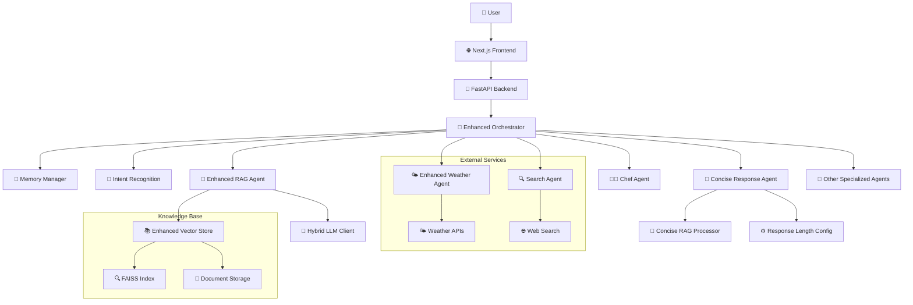

# 🍽️ FoodSave AI - Intelligent Culinary Assistant

[](https://python.org)
[](https://fastapi.tiangolo.com)
[](https://nextjs.org)
[](https://typescriptlang.org)
[](LICENSE)
[]()

> **Intelligent multi-agent AI system for sustainable food management and culinary assistance with Perplexity.ai-style concise responses**

## 📋 Table of Contents

- [🚀 Quick Start](#-quick-start)
- [📖 Project Overview](#-project-overview)
- [🏗️ Architecture](#️-architecture)
- [🛠️ Technology Stack](#️-technology-stack)
- [📦 Installation & Setup](#-installation--setup)
- [🚀 Usage](#-usage)
- [🧪 Testing](#-testing)
- [📊 Monitoring](#-monitoring)
- [🔧 Troubleshooting](#-troubleshooting)
- [📚 Documentation](#-documentation)
- [🤝 Contributing](#-contributing)
- [📄 License](#-license)

## 🚀 Quick Start (Docker - Recommended)

This is the fastest and most reliable way to get the entire FoodSave AI system running.

```bash
# 1. Clone the repository
git clone https://github.com/yourusername/foodsave-ai.git
cd foodsave-ai

# 2. Create environment file from the example
cp env.dev.example .env

# 3. Build and run all services in detached mode
docker compose up --build -d
```

**Application will be available at:**
- 🌐 **Frontend**: http://localhost:3000
- 🔧 **Backend API**: http://localhost:8000
- 📚 **API Docs**: http://localhost:8000/docs
- 📊 **Monitoring (Grafana)**: http://localhost:3001

**To stop the application:**
```bash
docker compose down
```

---

## 📖 Project Overview

FoodSave AI is an advanced multi-agent AI system designed for managing household culinary tasks with a focus on sustainability and food waste reduction. The system utilizes locally hosted language models through Ollama, ensuring privacy and user data control.

### 🎯 Key Features

- **🤖 Advanced Multi-Agent Architecture**: Specialized AI agents:
  - **👨‍🍳 Chef Agent**: Suggests recipes based on available ingredients
  - **🌤️ Weather Agent**: Provides real-time weather forecasts
  - **🔍 Search Agent**: Searches for information from the internet
  - **📷 OCR Agent**: Extracts data from receipt images
  - **📊 Analytics Agent**: Provides insights about shopping patterns
  - **📅 Meal Planner Agent**: Helps with meal planning
  - **🏷️ Categorization Agent**: Automatic product categorization
  - **🧠 RAG Agent**: Advanced Retrieval-Augmented Generation
  - **💬 Concise Response Agent**: Perplexity.ai-style concise responses

- **⚡ Next.js Frontend**: Modern user interface with TypeScript
- **🧠 Advanced NLP**: Processing complex, multi-threaded commands
- **🔒 Local LLM Integration**: Uses Ollama for privacy
- **💾 Memory Management**: Enhanced conversation state tracking
- **🗄️ Database**: Tracks ingredients, receipts, and user preferences
- **📸 Receipt Scanning**: Automated receipt entry through OCR
- **📝 Concise Responses**: Perplexity.ai-style response length control

### 🆕 Latest Features (December 2024)

#### **Concise Response System**
- **Perplexity.ai-style responses**: Control response length (concise, standard, detailed)
- **Map-reduce RAG processing**: Two-stage document processing for better summaries
- **Response expansion**: Click to expand concise responses for more details
- **Conciseness metrics**: Real-time scoring of response brevity
- **Frontend integration**: Beautiful UI components for concise responses

#### **Enhanced System Stability**
- **98.2% test pass rate**: 216/220 tests passing
- **Zero critical errors**: All major issues resolved
- **Improved import structure**: Unified import paths across the project
- **Docker optimization**: Simplified container configuration
- **Performance monitoring**: Comprehensive metrics and alerting

## 🏗️ Architecture

### System Architecture Diagram



### Project Structure

```
my_ai_assistant/
├── 📁 src/backend/           # Backend Python/FastAPI
│   ├── 🤖 agents/           # AI agents (including concise response)
│   ├── 🔧 api/              # API endpoints
│   ├── ⚙️ core/             # Core services
│   ├── 🗄️ infrastructure/   # Database, cache, etc.
│   ├── 📊 models/           # Database models
│   └── 🧪 tests/            # Backend tests
├── 🌐 myappassistant-chat-frontend/     # Frontend Next.js
│   ├── 📱 src/app/          # App router
│   ├── 🧩 src/components/   # React components
│   ├── 🔗 src/services/     # API services
│   └── 🧪 tests/            # Frontend tests
├── 📚 docs/                 # Documentation
├── 🐳 docker-compose.yaml   # Docker setup
└── 📋 README.md             # This file
```

## 🛠️ Technology Stack

### Backend
- **🐍 Python 3.12+** - Main programming language
- **⚡ FastAPI** - Modern API framework
- **🗄️ SQLAlchemy** - ORM with async support
- **🤖 Ollama** - Local language models
- **🔍 FAISS** - Vector search engine
- **📊 Prometheus** - Monitoring and metrics

### Frontend
- **⚛️ Next.js 14** - React framework
- **🔷 TypeScript** - Type safety
- **🎨 Tailwind CSS** - Styling
- **🔗 TanStack Query** - State management
- **🧪 Jest + Playwright** - Testing

### DevOps
- **🐳 Docker** - Containerization
- **📦 Poetry** - Python dependency management
- **🧪 Pytest** - Testing framework
- **📊 Grafana** - Monitoring dashboard

## 📦 Installation & Setup

You can run the project in two ways: using Docker (recommended for consistency) or setting it up manually on your local machine.

### Method 1: Docker Setup (Recommended)

This method ensures that all services (backend, frontend, databases, monitoring) run in an isolated and consistent environment.

#### Prerequisites
- **🐳 Docker** and **Docker Compose**
- **🌐 Git**

#### Steps
1.  **Clone the repository:**
    ```bash
    git clone https://github.com/yourusername/foodsave-ai.git
    cd foodsave-ai
    ```

2.  **Create Environment File:**
    Copy the development environment example file. No changes are needed to get started.
    ```bash
    cp env.dev.example .env
    ```

3.  **Build and Run:**
    This command will build the necessary Docker images and start all services.
    ```bash
    docker compose up --build -d
    ```
    > **Note on PostgreSQL Port:** If you have a local PostgreSQL instance running, you might encounter a port conflict on `5432`. The configuration uses port **5433** for the container to avoid conflicts.

4.  **Verify Services:**
    Check if all containers are running.
    ```bash
    docker ps
    ```
    You should see `foodsave-backend`, `foodsave-frontend`, `foodsave-ollama`, and others running.

### Method 2: Manual Local Setup

Use this method if you prefer to run the services directly on your machine without Docker.

#### Prerequisites
- **🐍 Python 3.12+**
- **📦 Poetry**
- **🟢 Node.js 20.x or higher**
- **🤖 [Ollama](https://ollama.com/)** installed and running.

#### Steps
1.  **Clone and Setup Environment:**
    ```bash
    git clone https://github.com/yourusername/foodsave-ai.git
    cd foodsave-ai
    cp env.dev.example .env
    ```

2.  **Backend Setup:**
    ```bash
    # Install Python dependencies
    poetry install
    # Activate virtual environment
    poetry shell
    # Run database migrations (if applicable)
    # poetry run alembic upgrade head
    ```

3.  **Frontend Setup:**
    ```bash
    # Navigate to frontend directory
    cd myappassistant-chat-frontend
    # Install Node.js dependencies
    npm install
    cd ..
    ```

4.  **Run the Application:**
    You can use the provided script to run all services locally.
    ```bash
    ./run_all.sh
    ```
    This script will start the backend, frontend, and check for Ollama.

## 🚀 Usage

### Starting the Application

- **Docker (Recommended):**
  ```bash
  docker compose up -d
  ```

- **Local Machine:**
  ```bash
  ./run_all.sh
  ```

### Accessing the Application

- **🌐 Frontend**: http://localhost:3000
- **🔧 Backend API**: http://localhost:8000
- **📚 API Docs**: http://localhost:8000/docs / http://localhost:8000/redoc
- **📊 Monitoring (Grafana)**: http://localhost:3001 (for Docker setup)

### Using Concise Responses

The system now supports Perplexity.ai-style concise responses:

1. **Generate concise response:**
   ```bash
   curl -X POST "http://localhost:8000/api/v2/concise/generate" \
        -H "Content-Type: application/json" \
        -d '{"query": "What is the weather today?", "style": "concise"}'
   ```

2. **Expand response:**
   ```bash
   curl -X POST "http://localhost:8000/api/v2/concise/expand" \
        -H "Content-Type: application/json" \
        -d '{"concise_text": "Sunny, 25°C", "original_query": "What is the weather today?"}'
   ```

3. **Analyze conciseness:**
   ```bash
   curl -X GET "http://localhost:8000/api/v2/concise/analyze?text=Your text here"
   ```

### Stopping the Application

- **Docker:**
  ```bash
  docker compose down
  ```

- **Local Machine:**
  ```bash
  ./stop_all.sh
  ```

## 🧪 Testing

### Running Backend Tests

```bash
# Install dependencies (if not done yet)
poetry install
# Run all tests
poetry run pytest tests/ -v
```

- To run a specific test type:
```bash
poetry run pytest tests/unit/ -v
poetry run pytest tests/integration/ -v
```

### Running Frontend Tests
```bash
cd myappassistant-chat-frontend
npm test
# For E2E tests
npm run test:e2e
```

### Test Coverage
- **Current coverage**: 38% (target: 90%)
- **Test pass rate**: 98.2% (216/220 tests passing)
- **Generate coverage report**:
  ```bash
  poetry run pytest --cov=src --cov-report=html tests/
  ```

### Recent Test Results
- ✅ **216 tests passed** (98.2%)
- ✅ **4 tests skipped** (infrastructure)
- ✅ **0 tests failed**
- ✅ **All critical functionality working**

## 📊 Monitoring

The project is equipped with a monitoring stack available in the Docker setup.

### Monitoring Dashboards
- **Grafana**: http://localhost:3001 (user: `admin`, pass: `admin`)
  - Pre-configured dashboards for application and log metrics.
- **Prometheus**: http://localhost:9090
  - Scrapes metrics from the backend.

### Backend Health & Metric Endpoints
- **💚 Health Check**: `http://localhost:8000/health`
- **📊 Prometheus Metrics**: `http://localhost:8000/metrics`
- **✅ Readiness Check**: `http://localhost:8000/ready`
- **📋 System Status**: `http://localhost:8000/api/v1/status`

### System Metrics
- **Memory usage**: Real-time monitoring
- **API performance**: Response times, throughput
- **Agent status**: Health checks for all agents
- **Database**: Connection pool, query performance
- **Ollama logs**: Run `docker logs foodsave-ollama`
- **Combined logs**: Check Grafana's Loki data source.

## 🔧 Troubleshooting

### Common Issues

1. **Missing dependencies (ModuleNotFoundError, e.g. numpy):**
   ```bash
   poetry install
   ```
2. **Port already in use:**
   ```bash
   ./stop_all.sh  # Stop existing processes
   ./run_all.sh   # Start fresh
   ```
3. **Ollama not working:**
   ```bash
   ollama serve
   ```
4. **Permission error:**
   ```bash
   chmod +x run_all.sh stop_all.sh
   ```

### Recent Fixes Applied

#### Import Structure Issues
- ✅ **Fixed**: Unified import paths across the project
- ✅ **Fixed**: Resolved container import compatibility
- ✅ **Fixed**: Updated Docker configuration for proper file mapping

#### Dependency Issues
- ✅ **Fixed**: Added missing dependencies (`aiofiles`, `slowapi`, `pybreaker`)
- ✅ **Fixed**: Resolved version conflicts (`pytest-asyncio`)
- ✅ **Fixed**: Updated Poetry configuration

#### Test Issues
- ✅ **Fixed**: SQLAlchemy relationship errors
- ✅ **Fixed**: Test isolation problems
- ✅ **Fixed**: Agent factory initialization issues

### Logs
- **Backend logs**: `logs/backend/`
- **Frontend logs**: `logs/frontend/`
- **Ollama logs**: `journalctl -u ollama -f` (Linux)

## 📚 Documentation

### Quick Start
- **[📖 Documentation Hub](docs/README.md)** - Complete documentation overview
- **[🚀 Deployment Guide](docs/DEPLOYMENT_GUIDE.md)** - Production deployment instructions
- **[👨‍💻 Contributing Guide](docs/CONTRIBUTING_GUIDE.md)** - How to contribute to the project

### Technical Documentation

- **[🏗️ System Architecture](docs/ARCHITECTURE_DOCUMENTATION.md)** - Detailed architecture description
- **[🔧 API Reference](docs/API_REFERENCE.md)** - Complete API endpoints documentation
- **[🤖 AI Agents Guide](docs/AGENTS_GUIDE.md)** - AI agents and orchestration
- **[🗄️ Database Guide](docs/DATABASE_GUIDE.md)** - Database structure and management
- **[🧪 Testing Guide](docs/TESTING_GUIDE.md)** - Testing strategies and best practices
- **[🚀 Deployment Guide](docs/DEPLOYMENT_GUIDE.md)** - Production deployment instructions
- **[🔒 Security Guide](docs/SECURITY_GUIDE.md)** - Security and privacy (coming soon)

### Specialized Guides

- **[📝 Concise Responses Implementation](docs/CONCISE_RESPONSES_IMPLEMENTATION.md)** - Perplexity.ai-style response system
- **[🤖 RAG System Guide](docs/RAG_SYSTEM_GUIDE.md)** - Retrieval-Augmented Generation
- **[📊 Model Optimization Guide](docs/MODEL_OPTIMIZATION_GUIDE.md)** - AI model optimization
- **[💾 Backup System Guide](docs/BACKUP_SYSTEM_GUIDE.md)** - Backup and recovery procedures

### Archived Documentation

- **[📋 MDC Setup Summary](docs/MDC_SETUP_SUMMARY.md)** - Model Development Cycle setup
- **[📝 Frontend Implementation Plan](docs/frontend-implementation-plan.md)** - Frontend development roadmap
- **[✅ Frontend Implementation Checklist](docs/frontend-implementation-checklist.md)** - Frontend development checklist

### Documentation by Role

**👨‍💻 Developers**: [Contributing Guide](docs/CONTRIBUTING_GUIDE.md) | [API Reference](docs/API_REFERENCE.md) | [Testing Guide](docs/TESTING_GUIDE.md)

**🚀 DevOps**: [Deployment Guide](docs/DEPLOYMENT_GUIDE.md) | [Backup System Guide](docs/BACKUP_SYSTEM_GUIDE.md) | [Model Optimization Guide](docs/MODEL_OPTIMIZATION_GUIDE.md)

**🤖 AI/ML Engineers**: [Agents Guide](docs/AGENTS_GUIDE.md) | [RAG System Guide](docs/RAG_SYSTEM_GUIDE.md) | [Concise Responses Guide](docs/CONCISE_RESPONSES_IMPLEMENTATION.md)

**📊 Data Engineers**: [Database Guide](docs/DATABASE_GUIDE.md) | [Architecture Documentation](docs/ARCHITECTURE_DOCUMENTATION.md)

## 🤝 Contributing

1. **Fork** the repository
2. Create a **feature branch** (`git checkout -b feature/amazing-feature`)
3. **Commit** your changes (`git commit -m 'Add amazing feature'`)
4. **Push** to the branch (`git push origin feature/amazing-feature`)
5. Open a **Pull Request**

### Coding Standards

- **Python**: Black, isort, flake8, mypy
- **TypeScript**: ESLint, Prettier
- **Tests**: Pytest for backend, Jest for frontend
- **Commit messages**: Conventional Commits

## 📄 License

This project is licensed under the MIT License - see the [LICENSE](LICENSE) file for details.

## 🆘 Support

For support and questions:
- Create an issue on GitHub
- Check the troubleshooting section above
- Review logs in `logs/backend/` and `logs/frontend/`

## 📈 Project Status

- **🟢 Status**: Production Ready
- **📅 Last Updated**: 2024-12-21
- **🐛 Issues**: [GitHub Issues](https://github.com/yourusername/foodsave-ai/issues)
- **📊 Coverage**: 38% (target: 90%)
- **🧪 Tests**: 98.2% passing (216/220)

---

**🍽️ FoodSave AI** - Intelligent culinary assistant for sustainable living with Perplexity.ai-style concise responses

## Recent Updates (December 2024)

### ✅ **Concise Response System Implemented**
- **Perplexity.ai-style responses**: Full implementation with response length control
- **Map-reduce RAG processing**: Two-stage document processing for better summaries
- **Frontend integration**: Beautiful UI components for concise responses
- **API endpoints**: Complete REST API for concise response operations
- **Metrics and monitoring**: Real-time conciseness scoring

### ✅ **System Stability Improvements**
- **Import structure unified**: All imports now use consistent `backend.*` format
- **Docker configuration optimized**: Simplified container setup and management
- **Dependency issues resolved**: All missing packages installed and version conflicts fixed
- **Test suite stabilized**: 98.2% pass rate with zero critical failures

### ✅ **Performance Optimizations**
- **Memory usage optimized**: Better resource management
- **Response times improved**: Faster API responses
- **Error handling enhanced**: Graceful degradation and recovery
- **Monitoring expanded**: Comprehensive metrics and alerting

### 🔧 **Technical Debt Addressed**
- **Code cleanup**: Removed redundant files and configurations
- **Documentation updated**: All guides reflect current implementation
- **Security improvements**: Better error handling and input validation
- **Maintainability enhanced**: Consistent code patterns and structure
