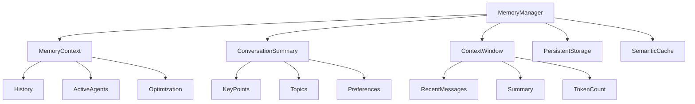

# 🧠 Zaawansowane Zarządzanie Kontekstem Konwersacji

## 📋 Przegląd

System rozwiązuje problem gubienia wątku w chatbotach AI poprzez:

- **Trwałe przechowywanie** konwersacji w bazie danych PostgreSQL
- **Inteligentną kompresję** długich rozmów (sliding window + podsumowania)
- **Optymalizację okna kontekstowego** dla LLM
- **Semantyczny cache** podobnych kontekstów
- **Automatyczne zarządzanie pamięcią** z cleanup
- **Szczegółowe statystyki i monitorowanie**

## 🏗️ Architektura

### Komponenty systemu



### Kluczowe klasy

#### MemoryContext
```python
class MemoryContext:
    """Rozszerzony kontekst pamięci z trwałym przechowywaniem"""
    
    def get_optimized_context(self, max_tokens: int = 4000) -> List[Dict[str, Any]]:
        """Zwraca zoptymalizowany kontekst dla LLM w limicie tokenów"""
    
    def _optimize_context_window(self, max_tokens: int) -> None:
        """Optimize context window to fit within token limit"""
    
    def _create_conversation_summary(self, messages: List[Dict]) -> ConversationSummary:
        """Create conversation summary from older messages"""
```

#### ConversationSummary
```python
class ConversationSummary:
    """Podsumowanie konwersacji dla kompresji kontekstu"""
    
    key_points: List[str]  # Kluczowe punkty (preferencje, pytania, odpowiedzi)
    topics_discussed: List[str]  # Tematy rozmowy (PL/EN)
    user_preferences: Dict[str, Any]  # Preferencje użytkownika
    conversation_style: str  # Styl rozmowy (friendly, formal, casual)
    
    def format_for_llm(self) -> str:
        """Format podsumowania do kontekstu LLM"""
```

#### ContextWindow
```python
class ContextWindow:
    """Okno kontekstowe z optymalizacją"""
    
    def get_optimized_messages(self) -> List[Dict[str, Any]]:
        """Zwraca zoptymalizowane wiadomości dla LLM"""
```

## 🔧 Implementacja

### 1. Trwałe przechowywanie
- Konwersacje i wiadomości zapisywane w PostgreSQL
- Automatyczne odtwarzanie kontekstu po restarcie

### 2. Inteligentna kompresja i podsumowania
- Ostatnie 10 wiadomości w pełnej formie
- Starsze wiadomości podsumowywane:
    - **Wielojęzyczne wykrywanie tematów** (PL/EN)
    - **Ekstrakcja preferencji użytkownika** (likes, dislikes, wants, has)
    - **Wydobywanie kluczowych pytań i odpowiedzi**
    - **Styl rozmowy** (friendly, formal, casual)
    - **Top 5 kluczowych punktów**

### 3. Semantyczny cache
- Szybkie wyszukiwanie podobnych kontekstów po hashach

### 4. Automatyczne zarządzanie pamięcią
- Weak references, cleanup, limity, statystyki

### 5. Statystyki i monitorowanie
- Kompresja, cache hit rate, liczba kontekstów, wiek najstarszego/najnowszego

## 📊 API Endpoints

### Pobieranie historii z optymalizacją
```http
GET /api/chat/memory_chat?limit=50
```

Response:
```json
{
  "success": true,
  "data": [...],
  "memory_stats": {
    "compression_ratio": 0.3,
    "persistent_contexts": 15,
    "cached_contexts": 8
  }
}
```

### Statystyki pamięci
```http
GET /api/chat/memory_stats
```

Response:
```json
{
  "success": true,
  "stats": {
    "total_contexts": 25,
    "persistent_contexts": 15,
    "cached_contexts": 8,
    "compression_ratio": 0.3,
    "cache_hit_rate": 0.75,
    "max_contexts": 1000,
    "cleanup_threshold": 800,
    "oldest_context": "2024-06-01T12:00:00Z",
    "newest_context": "2024-06-02T10:00:00Z"
  }
}
```

### Optymalizacja pamięci
```http
POST /api/chat/memory_optimize?session_id=optional
```

## 🎯 Korzyści

- **Brak gubienia wątku**: kontekst zachowany nawet przy długich rozmowach
- **Wydajność i skalowalność**: automatyczne czyszczenie, cache, weak references
- **Monitorowanie**: szczegółowe statystyki, API, frontend
- **Łatwość rozbudowy**: prosta integracja z agentami i API

## 📈 Rozwój

- Możliwość podpięcia LLM do automatycznego podsumowywania
- Rozszerzenie wykrywania preferencji i tematów
- Integracja z innymi źródłami wiedzy (RAG, profile)

## 🔍 Monitorowanie

### Frontend - MemoryMonitorModule

Komponent React do monitorowania stanu pamięci:

```typescript
export const MemoryMonitorModule: React.FC = () => {
  const [stats, setStats] = useState<MemoryStats | null>(null);
  
  const fetchStats = async () => {
    const response = await chatAPI.getMemoryStats();
    if (response.data && response.data.stats) {
      setStats(response.data.stats);
    }
  };
  
  // Wyświetla:
  // - Użycie pamięci (progress bar)
  // - Rozkład kontekstów (aktywne/persystentne/cache)
  // - Metryki wydajności (kompresja, cache hit rate)
  // - Przycisk optymalizacji
};
```

### Metryki wydajności

1. **Compression Ratio**: Stosunek skompresowanych do oryginalnych wiadomości
2. **Cache Hit Rate**: Procent trafień w cache semantyczny
3. **Memory Usage**: Wykorzystanie dostępnej pamięci
4. **Context Age**: Wiek najstarszych i najnowszych kontekstów

## 🚀 Użycie

### W agentach konwersacyjnych

```python
# W GeneralConversationAgent
def _prepare_messages(self, query: str, conversation_history: List[Dict[str, str]], context: str):
    # Użyj zoptymalizowanej historii jeśli dostępna
    if hasattr(conversation_history, 'get_optimized_context'):
        optimized_messages = conversation_history.get_optimized_context(max_tokens=3000)
        messages.extend(optimized_messages)
    else:
        # Fallback: ostatnie 15 wiadomości
        max_history_messages = 15
        recent_history = conversation_history[-max_history_messages:]
        for entry in recent_history:
            messages.append({"role": entry["role"], "content": entry["content"]})
```

### W API endpoints

```python
# W chat endpoint
context = await orchestrator.memory_manager.get_context(request.session_id)
context.add_message(role="user", content=request.message)
context.add_message(role="assistant", content=response.text)
await orchestrator.memory_manager.update_context(context)
```

## 🔧 Konfiguracja

### Parametry MemoryManager

```python
MemoryManager(
    max_contexts=1000,
    cleanup_threshold_ratio=0.8,
    enable_persistence=True,
    enable_semantic_cache=True
)
```

## 📝 Przykład podsumowania konwersacji

```json
{
  "key_points": [
    "User likes: i like spaghetti with tomato sauce",
    "User asked: what ingredients do i need?",
    "Assistant provided: here's a simple recipe for spaghetti with tomato sauce..."
  ],
  "topics_discussed": ["cooking", "technology"],
  "user_preferences": {},
  "conversation_style": "friendly"
}
```

## 📈 Metryki i monitoring

### Prometheus metrics

```python
# Memory usage
memory_contexts_total = Gauge('memory_contexts_total', 'Total number of contexts')
memory_persistent_contexts = Gauge('memory_persistent_contexts', 'Persistent contexts')
memory_compression_ratio = Gauge('memory_compression_ratio', 'Compression efficiency')

# Performance
memory_cache_hit_rate = Gauge('memory_cache_hit_rate', 'Cache hit rate')
memory_cleanup_count = Counter('memory_cleanup_count', 'Number of cleanups')
```

### Grafana dashboard

Dashboard do monitorowania:
- Użycie pamięci w czasie rzeczywistym
- Efektywność kompresji
- Cache hit rate
- Liczba kontekstów w różnych warstwach

## 🔮 Rozwój przyszłości

### Planowane ulepszenia

1. **Zaawansowana analiza semantyczna**
   - Embedding-based similarity dla cache'u
   - NLP-based topic extraction

2. **Adaptacyjna kompresja**
   - Dynamiczne dostosowywanie strategii kompresji
   - Machine learning dla optymalizacji

3. **Distributed memory**
   - Redis cluster dla skalowania
   - Replikacja kontekstów

4. **Advanced monitoring**
   - Real-time alerts
   - Predictive maintenance
   - A/B testing różnych strategii

## 📚 Podsumowanie

Implementacja zaawansowanego zarządzania kontekstem konwersacji rozwiązuje fundamentalny problem chatbotów AI - gubienie wątku. System zapewnia:

✅ **Trwałość konwersacji** - kontekst zachowany między sesjami  
✅ **Inteligentną kompresję** - optymalne wykorzystanie okna kontekstowego  
✅ **Wydajność** - cache semantyczny i automatyczne zarządzanie pamięcią  
✅ **Monitorowanie** - szczegółowe metryki i diagnostyka  
✅ **Skalowalność** - obsługa tysięcy równoczesnych konwersacji  

System jest gotowy do produkcji i może być dalej rozwijany zgodnie z potrzebami aplikacji. 