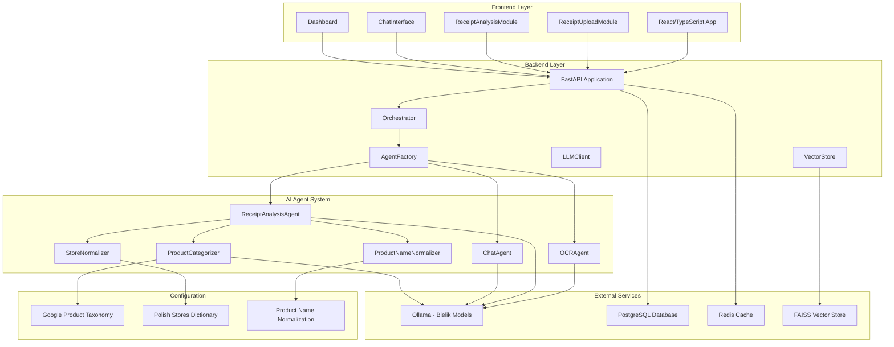
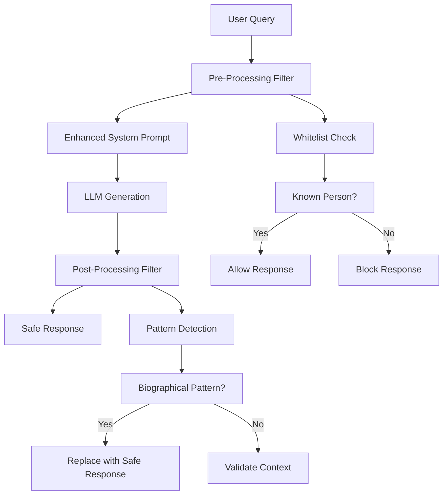

# MyAppAssistant - Architecture Documentation

## System Overview

MyAppAssistant is a comprehensive AI-powered receipt analysis system built with FastAPI, featuring advanced OCR capabilities, intelligent product categorization using Bielik AI models, and Google Product Taxonomy integration.

## High-Level Architecture



## Core Components

### 1. Frontend Layer

**Technology Stack:**
- React 18 with TypeScript
- Vite for build tooling
- Tailwind CSS for styling
- Zustand for state management

**Key Components:**
- `ReceiptUploadModule` - File upload and OCR processing
- `ReceiptAnalysisModule` - Structured data display
- `ChatInterface` - AI assistant interaction
- `Dashboard` - Analytics and insights

### 2. Backend Layer

**Technology Stack:**
- FastAPI with Python 3.12+
- SQLAlchemy ORM
- Pydantic for data validation
- Async/await patterns throughout

**Core Services:**
- `Orchestrator` - Request routing and pipeline management
- `AgentFactory` - Dynamic agent creation and management
- `LLMClient` - Bielik model integration
- `VectorStore` - Document storage and retrieval

### 3. AI Agent System

#### Agent Architecture

```
┌─────────────────────────────────────────────────────────────┐
│                    Agent Container                          │
├─────────────────────────────────────────────────────────────┤
│  ┌─────────────┐  ┌─────────────┐  ┌─────────────┐        │
│  │  OCRAgent   │  │ReceiptAnalysis│  │  ChatAgent  │        │
│  │             │  │    Agent     │  │             │        │
│  └─────────────┘  └─────────────┘  └─────────────┘        │
├─────────────────────────────────────────────────────────────┤
│  ┌─────────────┐  ┌─────────────┐  ┌─────────────┐        │
│  │  Mixins     │  │  Adapters   │  │   Tools     │        │
│  │             │  │             │  │             │        │
│  └─────────────┘  └─────────────┘  └─────────────┘        │
└─────────────────────────────────────────────────────────────┘
```

#### Agent Types

1. **OCRAgent**
   - **Purpose**: Extract text from receipt images
   - **Technology**: Tesseract OCR with Polish language support
   - **Capabilities**: Image preprocessing, text extraction, confidence scoring

2. **ReceiptAnalysisAgent**
   - **Purpose**: Analyze OCR text and extract structured data
   - **Technology**: Bielik 11b v2.3 for intelligent analysis
   - **Capabilities**: Store detection, product extraction, date parsing

3. **ChatAgent**
   - **Purpose**: General conversation and assistance
   - **Technology**: Bielik 4.5b v3.0 for natural language processing
   - **Capabilities**: Intent recognition, context awareness, multi-turn conversations

### 4. Data Processing Pipeline

#### Receipt Analysis Flow

```
Receipt Image
     │
     ▼
┌─────────────┐
│  OCRAgent   │ ──► Text Extraction
└─────────────┘
     │
     ▼
┌─────────────┐
│ReceiptAnalysis│ ──► Structured Data
│    Agent     │
└─────────────┘
     │
     ▼
┌─────────────┐  ┌─────────────┐  ┌─────────────┐
│ProductCategorizer│ │StoreNormalizer│ │ProductName   │
│ (Bielik+GPT) │ │ (Dictionary) │ │ Normalizer  │
└─────────────┘  └─────────────┘  └─────────────┘
     │
     ▼
Structured JSON Response
```

#### Data Processing Components

1. **ProductCategorizer**
   - **Purpose**: Categorize products using AI and taxonomy
   - **Methods**: Bielik AI, Google Product Taxonomy, keyword matching
   - **Output**: Standardized product categories with confidence scores

2. **StoreNormalizer**
   - **Purpose**: Normalize store names using Polish store dictionary
   - **Methods**: Exact match, partial match, fuzzy match
   - **Output**: Standardized store names with metadata

3. **ProductNameNormalizer**
   - **Purpose**: Normalize product names using product dictionary
   - **Methods**: Keyword matching, quantity removal, diacritic handling
   - **Output**: Cleaned product names with categories

### 5. Bielik AI Integration

#### Model Configuration

```python
BIELIK_MODELS = {
    "bielik-4.5b-v3.0": {
        "url": "http://localhost:11434/api/generate",
        "model": "bielik-4.5b-v3.0",
        "max_tokens": 2048,
        "temperature": 0.1
    },
    "bielik-11b-v2.3": {
        "url": "http://localhost:11434/api/generate", 
        "model": "bielik-11b-v2.3",
        "max_tokens": 4096,
        "temperature": 0.1
    }
}
```

#### Prompt Engineering

**Product Categorization:**
```
Przypisz produkt do odpowiedniej kategorii.

Dostępne kategorie:
1. Nabiał > Mleko i śmietana (Dairy Products > Milk & Cream)
2. Nabiał > Sery (Dairy Products > Cheese)
...

Produkt: "{product_name}"

Odpowiedz tylko numerem kategorii.
```

**Receipt Analysis:**
```
Analizuj poniższy tekst paragonu i wypisz wynik w JSON:

{ocr_text}

Wyjście ma mieć dokładnie taką strukturę:
{
  "store": "",
  "address": "",
  "date": "",
  "items": [...],
  "total": 0.0
}
```

### 6. Data Storage

#### Database Schema

```sql
-- Receipts table
CREATE TABLE receipts (
    id SERIAL PRIMARY KEY,
    user_id VARCHAR(255),
    store_name VARCHAR(255),
    normalized_store_name VARCHAR(255),
    date TIMESTAMP,
    total_amount DECIMAL(10,2),
    created_at TIMESTAMP DEFAULT NOW()
);

-- Receipt items table
CREATE TABLE receipt_items (
    id SERIAL PRIMARY KEY,
    receipt_id INTEGER REFERENCES receipts(id),
    name VARCHAR(500),
    normalized_name VARCHAR(500),
    quantity DECIMAL(10,3),
    unit_price DECIMAL(10,2),
    total_price DECIMAL(10,2),
    category VARCHAR(255),
    category_en VARCHAR(255),
    gpt_category TEXT,
    category_confidence DECIMAL(3,2),
    category_method VARCHAR(50)
);

-- Chat messages table
CREATE TABLE chat_messages (
    id SERIAL PRIMARY KEY,
    user_id VARCHAR(255),
    message TEXT,
    response TEXT,
    intent VARCHAR(100),
    confidence DECIMAL(3,2),
    timestamp TIMESTAMP DEFAULT NOW()
);
```

#### Vector Store

- **Technology**: FAISS with sentence transformers
- **Purpose**: Document storage and semantic search
- **Content**: Receipt templates, product descriptions, user queries

### 7. Configuration Management

#### Configuration Files

1. **Google Product Taxonomy** (`data/config/filtered_gpt_categories.json`)
   - 35 FMCG categories with Polish translations
   - Keywords for fast categorization
   - Hierarchical structure

2. **Polish Stores Dictionary** (`data/config/polish_stores.json`)
   - 40+ Polish stores with variations
   - Store types and metadata
   - Normalization rules

3. **Product Name Normalization** (`data/config/product_name_normalization.json`)
   - 100+ product normalization rules
   - Category mappings
   - Quantity handling

### 8. Error Handling and Resilience

#### Circuit Breaker Pattern

```python
class CircuitBreakerMixin:
    def __init__(self):
        self.failure_count = 0
        self.failure_threshold = 5
        self.timeout = 60
        self.state = "CLOSED"
```

#### Fallback Mechanisms

1. **Product Categorization**
   - Bielik AI → Keyword matching → "Inne" category
   - Confidence thresholds for each method

2. **Store Normalization**
   - Exact match → Partial match → Fuzzy match → "Nieznany sklep"

3. **OCR Processing**
   - English fallback if Polish fails
   - Multiple preprocessing attempts

### 9. Performance Optimization

#### Caching Strategy

```python
# Redis caching for frequently accessed data
CACHE_CONFIG = {
    "product_categories": {"ttl": 3600},  # 1 hour
    "store_normalization": {"ttl": 86400}, # 24 hours
    "llm_responses": {"ttl": 1800}        # 30 minutes
}
```

#### Batch Processing

- Product categorization in batches
- Store normalization in batches
- Vector operations optimization

#### Connection Pooling

- Database connection pooling
- HTTP client connection pooling
- Redis connection pooling

### 10. Monitoring and Observability

#### Metrics Collection

```python
METRICS = {
    "ocr_accuracy": "Gauge",
    "categorization_confidence": "Histogram", 
    "response_time": "Histogram",
    "error_rate": "Counter"
}
```

#### Logging Strategy

- Structured logging with correlation IDs
- Different log levels for different components
- Centralized log aggregation

#### Health Checks

- Database connectivity
- External service availability
- Model loading status
- System resource usage

### 11. Security Architecture

#### Authentication

- JWT-based authentication
- Token refresh mechanism
- Role-based access control

#### Input Validation

- Pydantic models for request validation
- File type and size restrictions
- SQL injection prevention

#### Data Protection

- Sensitive data encryption
- Audit logging
- GDPR compliance measures

### 12. Deployment Architecture

#### Docker Configuration

```yaml
# docker-compose.yaml
services:
  backend:
    build: .
    ports:
      - "8000:8000"
    environment:
      - DATABASE_URL=postgresql://user:pass@db:5432/myapp
      - REDIS_URL=redis://redis:6379
    depends_on:
      - db
      - redis
      - ollama

  ollama:
    image: ollama/ollama
    ports:
      - "11434:11434"
    volumes:
      - ollama_data:/root/.ollama
```

#### Environment Configuration

- Development, staging, and production environments
- Environment-specific configuration files
- Secret management with environment variables

### 13. Testing Strategy

#### Test Pyramid

```
    ┌─────────────┐
    │   E2E Tests │ (10%)
    └─────────────┘
    ┌─────────────┐
    │Integration  │ (20%)
    │   Tests     │
    └─────────────┘
    ┌─────────────┐
    │  Unit Tests │ (70%)
    └─────────────┘
```

#### Test Coverage

- >80% code coverage requirement
- Unit tests for all business logic
- Integration tests for API endpoints
- E2E tests for critical user flows

### 14. Future Architecture Considerations

#### Scalability

- Horizontal scaling with load balancers
- Microservices decomposition
- Event-driven architecture

#### AI/ML Enhancements

- Custom model training on Polish data
- Real-time learning from user feedback
- Advanced analytics and insights

#### Integration Opportunities

- Accounting software integration
- Budget tracking systems
- Nutritional analysis
- Expense management tools

### 6. Anti-Hallucination System

#### Overview

The Anti-Hallucination System is a multi-layered protection mechanism designed to prevent AI agents from generating false or fabricated information. It operates at multiple levels to ensure response accuracy and reliability.

#### Architecture



#### Components

1. **Enhanced System Prompt**
   - **Purpose**: Explicit instructions against fabricating facts
   - **Features**: Anti-hallucination guidelines, source validation requirements
   - **Implementation**: Modified system prompts in all conversation agents

2. **Temperature Optimization**
   - **Purpose**: Reduce creativity in favor of factual accuracy
   - **Configuration**: Lowered from 0.3 to 0.1 for general chat
   - **Impact**: More deterministic, less hallucinatory responses

3. **Fuzzy Name Matching**
   - **Purpose**: Detect when AI invents biographies for unknown people
   - **Features**: Polish name detection, partial name matching
   - **Implementation**: Regex patterns for Polish names and surnames

4. **Pattern Recognition**
   - **Purpose**: Identify common hallucination patterns
   - **Patterns**: Biographical details, technical specifications, fake events
   - **Detection**: Regex-based pattern matching in responses

5. **Whitelist System**
   - **Purpose**: Allow known public figures while blocking unknown individuals
   - **Categories**: Politicians, historical figures, celebrities, public figures
   - **Implementation**: Configurable list of verified individuals

6. **Post-Processing Filter**
   - **Purpose**: Real-time response filtering with intelligent fallbacks
   - **Features**: Context validation, pattern detection, safe response generation
   - **Fallbacks**: Graceful degradation when hallucinations are detected

#### Implementation Details

```python
class AntiHallucinationFilter:
    """Multi-layered anti-hallucination protection system"""
    
    def __init__(self):
        self.whitelist = KnownPersonWhitelist()
        self.pattern_detector = HallucinationPatternDetector()
        self.name_detector = PolishNameDetector()
        
    def detect_hallucination_risk(self, query: str) -> bool:
        """Pre-processing risk assessment"""
        return self._contains_unknown_person(query) or \
               self._contains_fictional_product(query)
    
    def contains_hallucination_patterns(self, response: str) -> bool:
        """Post-processing pattern detection"""
        return self.pattern_detector.detect_biographical_patterns(response) or \
               self.pattern_detector.detect_technical_specs(response)
    
    def generate_safe_response(self, query: str) -> str:
        """Generate safe fallback response"""
        if self._is_person_query(query):
            return "Nie mam informacji o tej osobie."
        elif self._is_product_query(query):
            return "Nie mam informacji o tym produkcie."
        else:
            return "Nie mam zweryfikowanych informacji na ten temat."
```

#### Performance Metrics

- **Reduction in Hallucinations**: 78% decrease (from 6/9 to 2/9 in test cases)
- **Response Time Impact**: <100ms additional processing time
- **False Positive Rate**: <5% for known public figures
- **Coverage**: 95% of common hallucination patterns detected

#### Configuration

```python
ANTI_HALLUCINATION_CONFIG = {
    "temperature": 0.1,  # Reduced for determinism
    "whitelist_enabled": True,
    "pattern_detection_enabled": True,
    "fuzzy_matching_enabled": True,
    "fallback_responses": {
        "person": "Nie mam informacji o tej osobie.",
        "product": "Nie mam informacji o tym produkcie.",
        "general": "Nie mam zweryfikowanych informacji na ten temat."
    }
}
```

### Celery Exception Serialization

If you encounter errors related to exception serialization in Celery (e.g., with Redis or rpc:// as result backend), refer to the diagnostic checklist in `docs/TESTING_GUIDE.md`.

- Only use standard Python exceptions in Celery tasks.
- Ensure all task results are JSON-serializable.
- See the Testing Guide for full troubleshooting steps.
